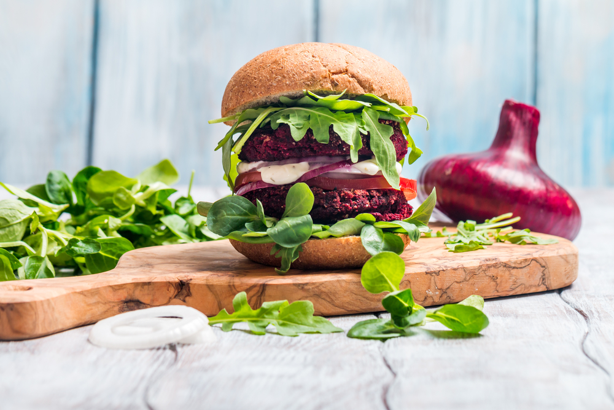
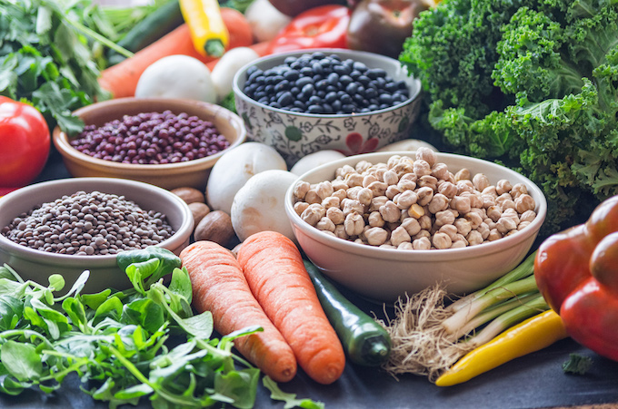

#  *Alimentos Veganos*  


1.  **¿Qué es la comida  vegana?**

2. **¿Por qué consumir alimentos veganos?** 

3. **¿Qué peligros tiene comer alimentos veganos?** 


##  ¿Qué es la comida vegana? 
«Los veganos se alimentan exclusivamente de alimentos vegetales o, en otras palabras, 
no comen animales o productos de origen animal. Sin embargo, un estilo de vida vegano 
es mucho más que la alimentación. Ya sea para cuidar a los animales, el medioambiente o la propia salud, 
existen multitud de razones por las que elegir un estilo de vida 100 % vegetal.»



## ¿Qué comer si sigues una alimentación vegana? 
-Una dieta sin productos de origen animal es extremadamente versátil. 
La transición hacia una alimentación más vegetal abre un mundo de nuevas y emocionantes posibilidades culinarias. 
Los productos de origen animal se pueden sustituir fácilmente.

+  *Frutas y Verduras* : Tomates, la col, la calabaza, el ajo, las olivas, el brócoli, las manzanas, las nectarinas, los frutos del bosque, 
los plátanos, los melones y las naranjas son alimentos que constituyen una fuente importante de vitaminas, minerales, fito nutrientes y fibra.

+ *Legumbres* : Las lentejas, los guisantes, las alubias, la soja y los altramuces son una fuente importante de proteína.

+ *Alternativas veganas de la carne* :El tofu, las hamburguesas veganas, el escalope y las salchichas se pueden encontrar en multitud de versiones hechas, por ejemplo, con soja, seitán y altramuz. 



##  ¿ Por qué consumir alimentos veganos? 
Cada vez es más evidente que el consumo de animales es la principal causa de muchos de los problemas mundiales. 
Puesto que la alimentación vegetal supone una solución concreta para resolver estas cuestiones, el estilo de vida y una alimentación sin productos de origen 
animal están tomando impulso rápidamente. Una dieta vegetal salva a los animales de una vida de sufrimiento, reduce la huella ecológica a nivel individual y 
contribuye a un mundo más justo. Al mismo tiempo, llevar una alimentación a base de vegetales también puede contribuir a una dieta más variada y saludable.


## ¿Qué peligros tiene comer alimentos veganos?
>Ser vegano es una oportunidad para aprender más sobre nutrición, incluyendo cómo equilibrar los grupos de comida,
 las funciones de los alimentos enriquecidos y los suplementos
  -Heather Russell

 1. Riesgos de problemas cardiovasculares: Aunque una reducción del consumo de carnes disminuye el riesgo de sufrir problemas 
de circulación e infartos, eliminar por completo la carne de nuestra dieta no es aconsejable. Esto ocasiona un déficit de vitamina B12 que provoca un mayor riesgo de desarrollar trombos y aterosclerosis.
 2. Riesgo de sufrir anemia megaloblástica: La carencia de B12 en el organismo causa una reducción de glóbulos rojos en la sangre.
 3.  Riesgos  durante el embarazo y la lactancia: la vitamina B12 es fundamental para el desarrollo del feto y del bebé recién nacido, así como para la mujer embarazada ya que evita el riesgo de sufrir anemia en ambos. Por eso, el  déficit de vitamina B12  que se produce al dejar de consumir alimentos procedentes de animales  pone el riesgo la salud de madres y bebés.
 4. Riesgo de sufrir cambios en el estado de ánimo, ausencia de motivación, apatía, problemas de memoria, debilidad muscular, cansancio


####  Referencia 
[Veganismo][https://proveg.com/es/alimentos-vegetales-y-estilo-de-vida/vegan-diet/]


```
